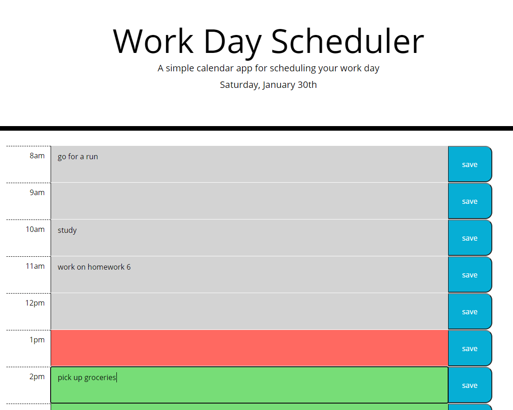

# Work-Day-Scheduler

## Description
Open the planner daily to see a new date displayed at the top. Each standard working hour includes a text area where events can be entered, and saved by clicking the save button to the right. Once an event is saved, the user can refresh, or exit the window without losing their plans. Additionally, the current hour is color coded red, while future hours are green, and past hours are greyed out.

My goal was to write the entire program in Javascript, with the aid of jQuery. You will see two script files, one of which is included to show the process of learning the moment.js library. My final js includes a forloop where all html elements, and classes are assigned. The goal here was simplicity. Because, the next challenge came from assigning past, present, and future 'classes' to each hour, allowing the background color to change as the current time does. This required the assignment of a data attribute, because I was having trouble representing the '8am'and '9am' hours as 'smaller'than the 'pm'hours. A data-hour attribute was the result. Later on, setting items to local storage, and getting them proved a challenge. The final result is shown by creating variables for each hour with the data hour attribute as the value. This took some time to get to. 
**[Check it out Here!](https://raseward14.github.io/Work-Day-Scheduler/)**

I learned a lot from writing the entire code in JS, assigning data hour attributes to the textarea elements, and using the data hour attributes to get objects from local storage. The only way to improve is to push yourself!

## Table of Contents
* [Usage](#usage)
* [Credits](#credits)
* [License](#license)

## Usage
* **The Finished Product**  

## Credits
Here are a few resources that helped me get this project knocked out!
* [Moment.js](https://momentjs.com/)
* [Dynamic Div](https://video.search.yahoo.com/search/video;_ylt=Awr9DuKrdxVguCAAZWZXNyoA;_ylu=Y29sbwNncTEEcG9zAzEEdnRpZAMEc2VjA3Nj?p=how+to+create+id%27s+in+for+loop+jquery&fr=mcafee#id=2&vid=9a04d345a23e586053974b989fcc6d06&action=view)
* [Stack Overflow](https://stackoverflow.com/questions/5037854/use-jquery-to-get-siblings)
* [The Web Developer Guide](https://www.thewebdeveloperguide.com/javascript-get-data-attribute/#:~:text=Using%20Javascript%20Get%20to%20a%20Data%20Attribute%20using,by%20its%20id%20using%20the%20Javascript%20document.getElementById%20function.)
* [Daily Dev Tips](https://daily-dev-tips.com/posts/vanilla-javascript-data-attributes/)

## License
©2021 Richard Seward. All Rights Reserved.
